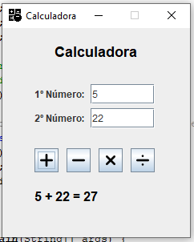

# Calculadora
Calculadora feita em Java com uso do JFrame

## Funcionamento
- IDE usada para desenvolvimento: Apache Net Beans 21
- Baixe o projeto e abra na sua IDE
- Execute o arquivo Calculadora.java (src/calculadora/Calculadora.java)

## Notas de Versão
- v2: correção na caixa de texto para exibir e na lógica da divisão
- v3: adição de botões para limpar, ocultar, exibir, habilitar e desabilitar campos
